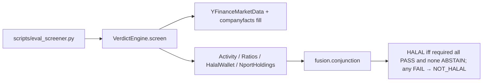
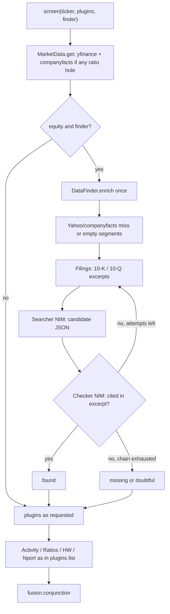
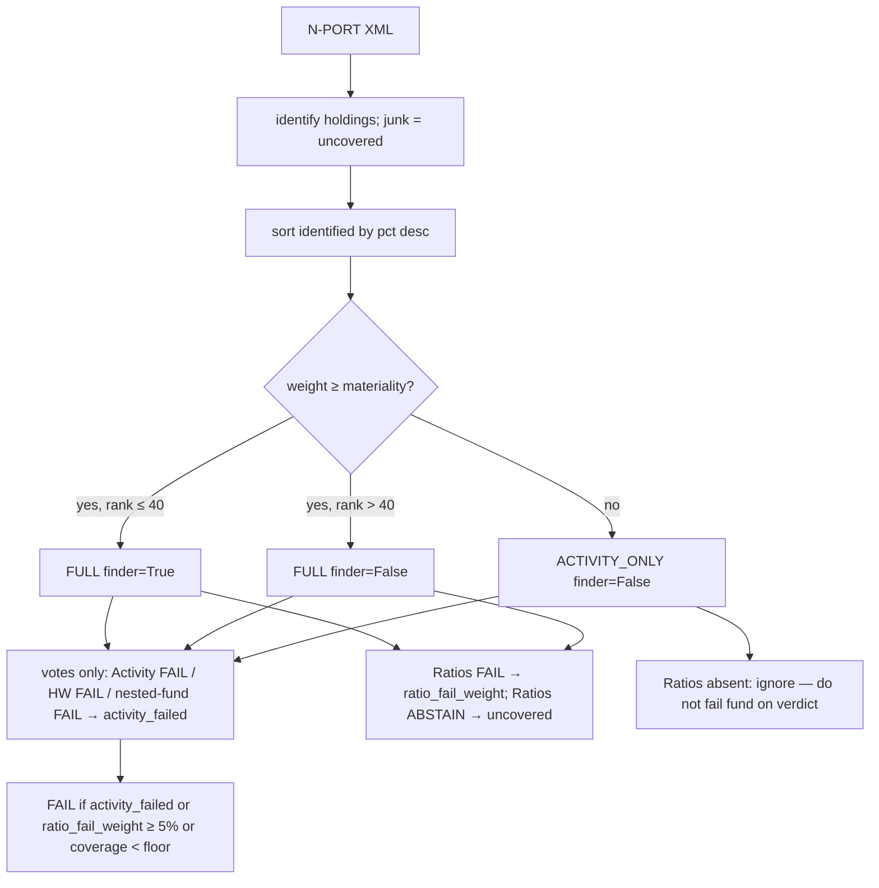
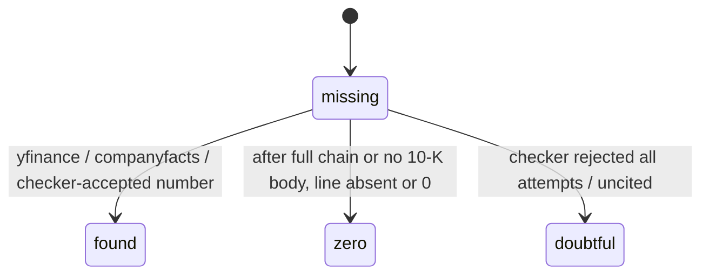
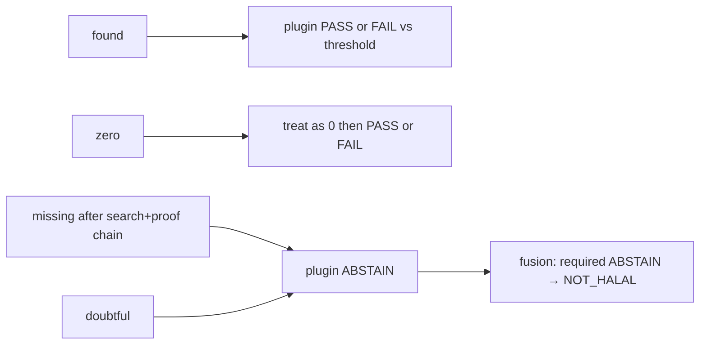

# Engine completeness — S&P Shariah 33%, data-finder LLM, N-PORT that fails haram (not holes)

| Field | Value |
|---|---|
| **Author** | Grok (research/spike; human implements later) |
| **Date** | 2026-08-22 |
| **Status** | Open Questions resolved 2026-08-22. Follow-up **searcher + checker AIs** and **do not stop at the first blank** locked same day. Contracts ready to implement. |
| **Issue** | [#7](https://github.com/anas11alshaer/halal-stock-screener/issues/7) |
| **Branch** | conceptually `fix/7-source-reliability`. Do not commit to `main`. Do not create `develop`. Keep dirty eval work (OpenFIGI-off-hot-path, STIV skip, series-id, Activity-both-fields, companyfacts-sum, `scripts/compare_mz_bar.py`). |
| **Work type** | research → implementable design. Open Questions + follow-up (searcher/checker, no first-blank fail) closed. Start at **PR 1**. No Telegram wire-up. |

Musaffa/Zoya remain a **test bar only**. They will leave production later. Do **not** add them as `VerdictEngine` plugins. Do **not** parse their HTML for HALAL.

Implement is **three sessions**, not ten PRs in one sitting. See **PR Plan**.

---

## Overview

The eval engine (`src/verdict_engine.py` + four plugins fused by `src/fusion.py:fuse_conjunction`) is the right shape: policy-driven, fail-closed, no SEO HALAL. It is not yet a Shariah screener. It still uses AAOIFI 30% on **spot** cap, always applies a cash screen (`src/plugins/ratios.py` ignores any `cash_screen_enabled` flag that does not exist), denies only yfinance sector/industry strings, treats missing Yahoo rows and HalalWallet `conditional` as NOT_HALAL, and fails Islamic ETFs because `_screen_holding_verdict` returns a binary child verdict.

This design switches the named standard in `config/screening_policy.toml` to **S&P Shariah (post-September 2023)**: debt **< 33%** of **36-month average market cap** (implement as FAIL if `ratio >= 33`), cash and AR screens **off** (requires a **ratios.py gate**, not TOML alone), impure income ≤ 5% of revenue (interest **plus** quantified haram segments). Activity grows a Yahoo-string denylist plus 10-K segment mix. NVIDIA NIM is **two roles**, never a judge: a **searcher** that hunts filings/excerpts for numbers, segments, and industry text, and a **checker** that only proofs “is that actually in the document?” The engine does **not** stop at the first Yahoo blank. N-PORT stays the ETF source; `ScreenHolding` returns `ScreenResult` so the fund fails if it **is haram**, not if LULU’s Yahoo row is empty.

Telegram (`src/bot.py` → `src/screener.py`) stays on Musaffa/Zoya until a later human sign-off.

---

## Background & Motivation

Live comparison (fixtures + 50 extra failed holdings; engine = current 30% AAOIFI, HW required-when-in-dataset, any-child ETF fail):

| Class | Tickers | What the engine did |
|---|---|---|
| Agreed HALAL | AAPL, NVDA, TSLA, XOM | Keep the path. |
| Agreed NOT_HALAL | JPM, BAC, MO, SPY, QQQ, PYPL | Keep Activity FAIL on banks/tobacco; keep SPY/QQQ look-through. PYPL already fails `Financial Services` + `Credit Services` — not a SPUS extra GICS cut. |
| Engine HALAL, bar stricter | **MSFT** (int ~0.99%), **GOOGL** (int ~1.08%) | Not a debt bug. MSFT is Xbox/Activision **segment** hidden under yfinance `Software - Infrastructure`. GOOGL is ads/YouTube and/or 1% vs 5% school. |
| Engine NOT_HALAL, bar HALAL | **SPUS, HLAL** (29–40 child fails); **CDW, TSCO** (debt 37%/36% vs 30%); **CSX, ECL, ITW, KO** (HW `conditional`); **DHI, LULU** (missing interest); **AMZN, WMT** (HW `conditional`; bar DOUBTFUL) | Data holes and maybes, not “the fund is a bank.” |

Locked mapping: **doubtful is NOT_HALAL** (binary engine). That lock applies to **our** leftover missing/doubtful facts after the finder, not to HalalWallet `conditional`. **Resolved Q3 = A:** unquantified `impure` → Ratios ABSTAIN; unquantified `core_fail` → Activity ABSTAIN. GOOGL and a 5.18% SPUS sleeve **likely FAIL until a cited %**. MSFT ~8.3% ordinary gaming **does not fail**. SPUS/HLAL must not get a ticker allowlist.

---

## Goals & Non-Goals

**Goals**

1. Named standard + numeric keys in `config/screening_policy.toml` (not plugin literals). Plugins read `[ratios]` numbers only; `standard.name` is a label.
2. Fact state machine: found / zero / missing / doubtful. Do **not** fail because Yahoo was blank. Run the source chain (Yahoo → companyfacts → 10-K/10-Q → searcher → checker). Unsure only after that chain is **exhausted** → ABSTAIN → NOT_HALAL. Never invent a number to “always find something.”
3. Activity denylist complete enough for S&P/DJIM **and** data-driven (yfinance strings now; 10-K segments in session 2). The list is “what the standard treats as dirty,” not a stock pick-list. Searcher+checker also **find and classify** segments / business text, not only fill ratio blanks.
4. ETF look-through that fails haram holdings, not Yahoo holes or junk N-PORT ids — requires a new `ScreenHolding` contract.
5. Two NIM roles (searcher, checker), each with its own bake-off; extract jobs 3/5/6/7/12 still have catalogs; winner + 429 fallback in **job-scoped** policy tables.
6. Tests from the disagreement set. Eval-only. Telegram untouched. Packed into **three implement sessions**.

**Non-goals**

- Wiring `VerdictEngine` into `src/bot.py`.
- Dropping Gemini / deleting Docker / Oracle deploy.
- LLM as Shariah judge; showing ratios in chat.
- Musaffa/Zoya as engine plugins; ticker allowlists.
- Changing N-PORT as the holdings **source** (Yahoo-as-holdings still forbidden).
- Paid search APIs (Exa, etc.).
- Rewriting ADR 0008/0009/0010 in place. **Add ADR 0013** that supersedes only HW-required, any-child-not-HALAL, and screenshot-only NIM (0011 is reserved for Oracle scripts-no-docker; 0012 is secrets).

---

## Key Decisions

1. **Named standard = `sp_shariah` (post-Sep 2023).** Debt / 36-month average market cap **< 33%** (FAIL if `ratio >= 33.0`). Cash and AR screens **disabled** in committed TOML; `ratios.py` must **gate** on `cash_screen_enabled` / `receivables_screen_enabled`. Missing keys default to **today’s** behavior (cash **on**). **No 2% S&P hysteresis** (stricter). `totalDebt` is a conservative numerator. Trailing avg = `Pavg/Plast * spot`; short history → `spot_fallback`. **SPUS extra GICS (40203040 / 40201060) are not committed this loop.** Yahoo `Aerospace & Defense` stays (already shipping). PYPL already fails finance strings.

2. **Gaming: allow ordinary interactive entertainment.** SPUS held **MSFT at 9.27% NAV on 2026-08-21** (index evidence, not an allowlist). Microsoft FY25 Gaming **$23.455B / $281.724B ≈ 8.3%** does **not** fail. Impure/fail only gambling mechanics, loot boxes, adult content. Keyword hits map through `[activity.segments]`; `allow` is never doubtful. No MSFT ticker exception.

3. **Doubtful → NOT_HALAL. Unquantified denied-tag = A (locked).** Keep `Vote.PASS|FAIL|ABSTAIN`. `unquantified_denied_tag = "doubtful"`. Unquantified `impure` → **Ratios ABSTAIN**; unquantified `core_fail` → **Activity ABSTAIN**. Do not add `DOUBTFUL`. Do not ship B (`ignore`).

4. **Two NIM roles, never a judge.** **Searcher** finds excerpts and candidate facts (numbers, segment names, industry strings, identifier maps). **Checker** only proofs: the number/tag string-matches the excerpt after normalization. Neither emits `HALAL` / `NOT_HALAL` / `verdict` / `core_fail`. Policy maps tags. Invented numbers → checker reject → retry another excerpt; still uncited → doubtful. Activity `core_fail` cannot be overridden to PASS by a model. The AI is not “blank filler only”: it also searches and classifies (jobs 5, 6, 7, 12, 14) against the **policy** table.

5. **HalalWallet: FAIL-only overlay, not required.** Set `fusion.add_required_when_in_dataset = []`. **Keep the fusion.py hook** so TOML can restore HW-required. Explicit `not_halal` or false activity/financial flags → FAIL (optional FAIL still vetoes via `fuse_conjunction` lines 20–21). `conditional` / unknown / fetch error → ABSTAIN and **not** required. Job 14 does **not** re-veto on “HW was conditional.”

6. **ETF aggregation: structured child `ScreenResult.votes` only — never `result.verdict`.** Activity FAIL, HW overlay FAIL, or nested-fund FAIL on any identified holding ≥ epsilon → fund FAIL. Ratios FAIL **weight** ≥ 5% → fund FAIL. Junk ids and unresolved **material** ratios = **uncovered**, not haram. Sub-materiality names: Activity-only; missing interest is ignored. ACTIVITY_ONLY children with `verdict == NOT_HALAL` (Ratios not run) must **not** fail the fund.

7. **No ticker allowlists.** If SPUS/HLAL become HALAL it is because holdings cleared the new rules.

8. **Free sources first.** yfinance + SEC companyfacts + N-PORT XML + 10-K HTML from EDGAR Archives + HalalWallet JSON. No Exa.

9. **MiniMax-M3 is not frozen and is non-commercial on NIM.** Re-bake every job. `write_nvidia_winner` must become **job-scoped** before any `[nvidia.jobs.*] winner =` keys exist.

10. **Telegram stays old.** `test_verdict_engine.py` already asserts `VerdictEngine` is not in `src/bot.py`.

11. **Do not stop at the first blank.** Yahoo miss is a **trigger**, not a verdict. Chain: yfinance → companyfacts → 10-K/10-Q excerpts → searcher → checker. Checker reject retries another excerpt (bounded). Fail-closed only when the chain is exhausted or the checker still will not cite. “Always search, then prove” ≠ invent a %.

---

## Proposed Design

### Current eval path (keep)



Telegram path is separate (`StockScreener` + scrapers) and **out of scope**.

### Target eval path (engine calls enrich once; inside: search → proof → retry)



ETF look-through (inside `NportHoldingsPlugin` — **scores `result.votes` only, never `result.verdict`**):



### Components (no new frameworks, no undeclared deps)

| Piece | File | Change |
|---|---|---|
| Policy | `config/screening_policy.toml`, `src/policy.py` | `standard` label, trailing window, cash/AR **gates**, `unquantified_denied_tag`, ETF weight keys, `[finder]`, per-job NVIDIA tables. |
| Fundamentals | `src/plugins/base.py` | `FactState`, `Segment`, `DenominatorSource`, `gics`, `income_statement_present`, AR, trailing cap, segments, `fact_states`. |
| Market data | `src/market_data.py` | Trailing avg; AR tags; **gate companyfacts on any missing ratio input**; `fact_states["segments"]=MISSING` for EQUITY; **shared CIK helper**. |
| Filings | **new** `src/filings.py` | EDGAR submissions → latest 10-K HTML. stdlib `html.parser` + heading regex. CIK via shared helper. |
| Data finder | **new** `src/data_finder.py` | `async def enrich(ctx) -> Fundamentals`. Dispatch table (jobs 6+7+12 even if ratios found). **Searcher + checker**; bounded retries on reject. In-process CIK cache. |
| Engine | `src/verdict_engine.py` | Inject `finder=`; `screen(..., plugins=, finder=)`; cache key includes plugins+finder; `ScreenHolding` returns `ScreenResult`. Engine still calls `enrich` **once**. |
| Activity | `src/plugins/activity.py` | Yahoo strings + substring list + segment table. Funds still ABSTAIN. |
| Ratios | `src/plugins/ratios.py` | `>=` vs 33; cash/AR gated; impure = interest + `impure` segment revenue. |
| N-PORT | `src/plugins/nport.py` | `ScreenHolding` → `ScreenResult` + mode; weighted score. |
| HW | `src/plugins/halalwallet.py` | FAIL-only; ABSTAIN on conditional/unavailable. Fusion **hook stays**. |
| NIM | `src/nvidia_nim.py` | `chat_text`; job-scoped writer; per-job `max_tokens`. |
| Eval | `scripts/eval_screener.py`; **new** `scripts/eval_nim_jobs.py` | Keep `compare_mz_bar.py`. Image Jaccard stays in `eval_image_models.py`. |
| ADR | **new** `docs/adr/0013-engine-completeness.md` | Supersedes HW-required, any-child-FAIL, screenshot-only NIM. |
| Tests | `tests/test_verdict_engine.py` + new modules | Invert HW-required tests; disagreement fixtures. |

---

## API / Interface Changes

### Fact types (`src/plugins/base.py`)

```python
class FactState(str, Enum):
    FOUND = "found"
    ZERO = "zero"
    MISSING = "missing"
    DOUBTFUL = "doubtful"

class DenominatorSource(str, Enum):
    TRAILING_AVG = "trailing_avg"
    SPOT_FALLBACK = "spot_fallback"
    SPOT = "spot"

class HoldingScreenMode(str, Enum):
    FULL = "full"
    ACTIVITY_ONLY = "activity_only"

@dataclass
class Segment:
    name: str
    revenue: float | None
    revenue_pct: float | None
    tags: list[str]          # activity.segments.id values only
    state: FactState
    excerpt: str | None = None

@dataclass
class Fundamentals:
    ticker: str
    quote_type: str = "UNKNOWN"
    sector: str | None = None
    industry: str | None = None
    gics: str | None = None
    company_name: str | None = None
    market_cap: float | None = None
    trailing_avg_market_cap: float | None = None
    trailing_avg_months: int | None = None
    denominator_source: DenominatorSource = DenominatorSource.SPOT
    total_debt: float | None = None
    cash_and_securities: float | None = None
    accounts_receivable: float | None = None
    interest_income: float | None = None
    revenue: float | None = None
    income_statement_present: bool = False
    segments: list[Segment] = field(default_factory=list)
    business_description: str | None = None
    fact_states: dict[str, FactState] = field(default_factory=dict)
```

`income_statement_present` is True if yfinance `financials` is non-empty **or** companyfacts returned a us-gaap FY for revenue/interest.

`YFinanceMarketData.get` for non-fund EQUITY **must** set `fact_states["segments"] = FactState.MISSING` when `segments` is empty. Empty `[]` is not “found no segments.” Without that, jobs 6/7/12 never run on MSFT (ratios already found) and Xbox never appears.

### VerdictEngine constructor

Live `__init__` injects `market`, `nport`, `halalwallet_records`, `http`. Add `finder`:

```python
def __init__(
    self,
    policy: Policy,
    *,
    market: MarketData | None = None,
    nport: NportClient | None = None,
    halalwallet_records: dict | None = None,
    http: httpx.AsyncClient | None = None,
    finder: DataFinder | None = None,  # tests inject a fake; no NVIDIA_API_KEY
) -> None:
    ...
    self._finder = finder  # None → lazy in _ensure_clients
```

Lazy path (same pattern as market/nport): if `self._finder is None` and enrich is needed, build `NvidiaNimClient` + `FilingsClient` from `self._http` and `config.NVIDIA_API_KEY`. **If the key is missing or empty, `enrich` is a no-op** that leaves MISSING/DOUBTFUL untouched (pytest never needs a live key). Session 2 tests pass `finder=FakeFinder(...)`.

**Shared CIK helper** (not copy-pasted): extract `async def cik_for(ticker: str, *, http, policy) -> str | None` from `YFinanceMarketData._cik_for` / `_company_tickers` into a module-level function in `src/market_data.py` (or a tiny `src/sec_cik.py`). `FilingsClient.tenk_excerpts` and DataFinder use that helper. Do not duplicate the company_tickers.json parse.

### VerdictEngine.screen

```python
async def screen(
    self,
    ticker: str,
    depth: int = 0,
    *,
    plugins: Sequence[str] | None = None,  # None → policy.enabled_plugins
    finder: bool = True,
) -> ScreenResult:
    ticker = ticker.upper().strip()
    plugin_key = tuple(plugins) if plugins is not None else None
    cache_key = (ticker, depth, plugin_key, finder)
    # FULL vs ACTIVITY_ONLY vs finder=False must not collide (live key is only (ticker, depth)).
    if cache_key in self._cache:
        return self._cache[cache_key]
    ...
    fundamentals = await self._market.get(ticker)
    ctx = ScreenContext(...)
    if finder and not is_fund(quote_type, self.policy):
        fundamentals = await self._finder.enrich(ctx)   # once from engine; search-proof retries live inside enrich
        ctx = replace(ctx, fundamentals=fundamentals)
    names = list(plugins) if plugins is not None else self.policy.enabled_plugins
    required = required_plugin_names(...)
    if plugins is not None:
        required = [n for n in required if n in plugins]  # child verdict is log-meaningful
    # vote only `names`; fuse(votes, required)
    # self._cache[cache_key] = result  — same engine instance must not reuse FULL for ACTIVITY_ONLY
```

When `plugins=` is omitted (top-level equity/ETF), required stays the full policy set. When N-PORT calls `plugins=["Activity", "HalalWallet"]`, required becomes `["Activity"]` (HW only if still in the add-required list). **ETF scoring still must not read `result.verdict`** (defense in depth).

N-PORT callback **today** (`src/verdict_engine.py:99-101`, `src/plugins/nport.py:20`):

```python
ScreenHolding = Callable[[str, int], Awaitable[str]]  # binary verdict — replace
```

**After:**

```python
ScreenHolding = Callable[[str, int, HoldingScreenMode, bool], Awaitable[ScreenResult]]
# args: ticker, depth, mode, finder

async def _screen_holding(
    self,
    ticker: str,
    depth: int,
    mode: HoldingScreenMode,
    finder: bool,
) -> ScreenResult:
    if mode is HoldingScreenMode.ACTIVITY_ONLY:
        return await self.screen(
            ticker,
            depth=depth,
            plugins=["Activity", "HalalWallet"],
            finder=False,
        )
    return await self.screen(ticker, depth=depth, finder=finder)
```

**ETF scoring uses `result.votes` only. Never `if result.verdict != "HALAL"`.** That live loop (`nport.py:137-142`) is the bug PR 7 deletes. ACTIVITY_ONLY AAPL with Activity PASS, Ratios not in `votes`, `verdict == NOT_HALAL` must **not** fail the parent fund.

**HW on a child:** `Vote.FAIL` counts as **activity-fail** (overlay, any weight ≥ epsilon). `Vote.ABSTAIN` is **ignored** for ETF scoring.

`NportHoldingsPlugin.vote` metrics: `activity_failed_holdings`, `nested_fund_failed`, `ratio_fail_weight`, `unresolved_ratio_weight`, `uncovered_weight`, `junk_ids`.

No Telegram / `ScreenResponse` change.

### DataFinder

```python
class DataFinder:
    def __init__(self, policy: Policy, nim: NvidiaNimClient, filings: FilingsClient) -> None:
        self._by_cik: dict[str, Fundamentals] = {}  # required for ETF eval (job 20)

    async def enrich(self, ctx: ScreenContext) -> Fundamentals:
        """Engine calls this once. Inside: searcher then checker, bounded retries.
        Never returns a verdict. Dispatch below — not 'any missing ratio' only."""
```

Call site: `VerdictEngine.screen` after `market.get`, **once**, only if `finder=True` and quote_type is not a fund wrapper. **Do not** loop `enrich` in the engine. Retries are inside `enrich` per field / per excerpt.

**Two roles (must, session 2):**

| Role | What it does | What it must not do |
|---|---|---|
| **Searcher** | Pick the next free source excerpt (Item 1, segment note, 10-Q, interest note). Emit candidate JSON: numbers, segment names, industry strings, keyword hits. | Say HALAL / NOT_HALAL / `core_fail`. Invent a number not in the prompt excerpt. |
| **Checker** | Input = searcher JSON + the excerpt. Output `{"accepted": bool, "reason": str}`. Accept only if every number/tag is in the excerpt after the same normalization as the bake-off scorer. | Bless an uncited number. Output a verdict. Override Activity denylist. |

If checker `accepted=false` and attempts remain: fetch/try **another** excerpt (10-Q if 10-K note missed; next heading). If attempts exhausted: field stays **missing** (no 10-K body) or **doubtful** (body present, still uncited). That is fail-closed **after** search+proof, not after the first Yahoo blank.

**Dispatch (EQUITY).** Run in this order; count **NIM** calls (searcher **and** checker) separately from filings HTTP:

| When | Jobs | Notes |
|---|---|---|
| Each of interest/revenue/debt/cash still MISSING | 3 | one call can fill several fields from the same excerpt |
| AR still MISSING | 4 | lowest NIM priority |
| sector **or** industry missing | 5 | |
| `segments` empty **or** `fact_states["segments"] == MISSING` | **6 + 7 + 12** | **always for EQUITY**, even if every ratio is found. This is how MSFT Xbox is seen. |

Job 7 may be deterministic keyword match on names from job 6 (no NIM). Job 12 may reuse the Item 1 excerpt already fetched for job 6 (one NIM or regex on the same text). Either way they **run**.

`max_searcher_calls_per_equity = 4` and `max_checker_calls_per_equity = 4` (8 NIM calls worst case). Drop **lowest-priority** searcher jobs if over cap. Priority (keep first): **6, 12, 3, 5, 7-if-NIM, 4**. **Never skip 6 or 12** on software-GICS (or any EQUITY with empty segments) to save budget. If 6+12+3+5 already equal 4 searcher calls, drop 4 (AR) and 7-NIM. Checker calls pair with whatever searcher produced; a reject+retry counts as extra searcher **and** extra checker.

`searcher_attempts_per_field = 3`: Yahoo miss is attempt 0 (deterministic). Then up to 3 searcher excerpts. Stop early on checker accept.

CIK cache: second ticker with the same CIK reuses filled `segments` / 10-K excerpts and does not spend another 6/12 NIM call.

**Deterministic before NIM:** yfinance row aliases, companyfacts tags, heading regex, policy keyword match on a segment **name** (job 7 may skip NIM). NIM searcher is for holes those cannot fill, **and** for Item 1 / segment classification even when ratios are already found.

### Filings (`src/filings.py`, stdlib only)

```python
class FilingsClient:
    async def tenk_excerpts(self, *, ticker: str, cik: str | None = None) -> dict[str, str]:
        """Keys subset of {"item1", "segments"} — absent key means missing, not zero.
        If cik is None, resolve via the shared cik_for() helper (same company_tickers map as market_data)."""
```

Path: `cik_for` → `sec_submissions_url` → latest `10-K`/`10-K/A` → `sec_archives_url` HTML. `html.parser` to text. Heading regex for `Item 1` / `Business` and `Segment` / `Note 18` / `Note` + `segment`. Truncate each value to `finder.max_excerpt_chars`. **No new deps.** If the heading is not found, omit the key (**missing**, not zero).

### NIM text

```python
# NvidiaNimClient — add beside chat_vlm (max_tokens=512 is too small for segments)
async def chat_text(
    self, *, model_id: str, prompt: str, max_tokens: int = 2048, url: str | None = None
) -> str:
    payload = {
        "model": model_id,
        "messages": [{"role": "user", "content": prompt}],
        "max_tokens": max_tokens,
        "temperature": 0,
        "stream": False,
        "response_format": {"type": "json_object"},
    }
```

Reject searcher **or** checker payload that contains `HALAL`, `NOT_HALAL`, `verdict`, or `core_fail`. Checker `accepted=true` with a number not in the excerpt after normalization is a test failure (treat as reject).

`write_job_winner(policy_path, job: str, winner: str, fallback: str)` patches **only** `[nvidia.jobs.<job>]` `winner` / `fallback_429`. Keep top-level `[nvidia] winner` as an alias of `screenshot_tickers` until ImageParser is wired. Tests: two `winner =` keys in one file; screenshot bake-off must not patch a 10-K job table.

---

## Data Model Changes

SQLite (`src/database.py`) is unused by `VerdictEngine`. **No schema migration.**

Local files:

- `data/openfigi_cusip_tickers.json` — CUSIP→ticker only. Cache-only on `holdings()`.
- `data/nport_ticker_aliases.json` — **separate** gitignored map (`LEN/B` → `LEN.B`). Do not mix alias keys into the CUSIP cache.
- Keep untracked `scripts/compare_mz_bar.py` (do not delete). Commit later as eval-only if the human wants it.

---

## 1. Review verdict: keep / change / drop

| Behavior | Verdict | Why |
|---|---|---|
| Conjunction fusion; empty required → NOT_HALAL | **KEEP** | ADR 0008. |
| Policy-driven thresholds; no ticker allowlists | **KEEP** | Tests grep `SPUS`/`HLAL`. |
| Activity + Ratios required EQUITY; N-PORT required funds | **KEEP** | |
| Activity ABSTAIN if sector **or** industry missing | **KEEP** | Both-fields dirty work. |
| `Financial Services` sector denylist | **KEEP** (blunt) | Agrees JPM/BAC/PYPL. Islamic banks / takaful: **no exception** this loop. |
| Aerospace & Defense Yahoo industry | **KEEP** | Already in committed denylist. SPUS extras 40203040/40201060 **not** added. |
| Ratios 30% AAOIFI, spot cap | **CHANGE** | 33% + trailing avg. FAIL if `>= 33`. |
| Cash always applied; missing cash ABSTAIN | **CHANGE** | Gate `cash_screen_enabled`; default **True** if key missing. |
| Missing interest → ABSTAIN, no finder | **CHANGE** | Do not stop at Yahoo. yfinance **and** companyfacts **and** searcher+checker (or no 10-K body). Then zero or doubtful. |
| Impure = interest only | **CHANGE** | + `impure` segment revenue in **Ratios**. |
| HW required-when-in-dataset | **DROP required** | Keep fusion **hook**; empty TOML list. |
| N-PORT source, series-id, STIV, OpenFIGI off hot path, 0.95 floor | **KEEP** | ADR 0009 source rules. |
| Any identified child ≠ HALAL → ETF FAIL | **CHANGE** | ADR 0013. Structured `ScreenResult`. |
| Junk ids as haram | **CHANGE** | Uncovered. |
| NVIDIA screenshot-only MiniMax | **CHANGE** | Per-job catalog; **searcher + checker**; job-scoped writer first. |
| Gemini / Telegram scrapers | **KEEP until later** | |
| Musaffa/Zoya engine plugins | **DROP / never add** | |

---

## 2. Named standard + exact policy keys

DJIM and S&P are **not** identical.

| | DJIM (historic) | S&P Shariah (historic) | Both **post-Sep 2023** |
|---|---|---|---|
| Debt | < 33% of **24-mo** avg MC | < 33% of **36-mo** avg MC | Windows differ |
| Cash + interest securities | < 33% of 24-mo | < 33% of 36-mo (stale RI page) | **Removed** |
| Accounts receivable | < 33% of 24-mo (DJIM dropped AR Feb 2023) | < 49% of 36-mo | **Removed** |
| Impure income | < 5% of total revenue | < 5% of total revenue | Kept |

Sources: arXiv:2512.22858v2 Table 1; S&P DJI 14 Feb 2023 / 4 Aug 2023 announcements. RI public page still shows pre-2023 cash/AR — **stale**. S&P/DJIM use **strictly < 33%** and a **2 percentage-point hysteresis** for previously compliant names. We implement `< 33%` as FAIL-if-`>= 33` and **omit hysteresis** (stricter). Live `debt_pct > debt_lim - margin` makes **33.0 PASS**; PR 1 switches to `>=`.

**SPUS:** 497K 30 Mar 2023 uses the **pre-GICS-2023 name** “Data Processing & Outsourced Services.” Current extra sub-industries (S&P DJI 6 Jan 2023, effective 20 Mar 2023): **20101010 Aerospace & Defense**, **40203040 Financial Exchanges & Data**, **40201060 Transaction & Payment Processing Services**. **Never GICS 20202020**. PYPL already fails finance strings. **Human: do not commit 40203040 / 40201060 this loop.** Yahoo `Aerospace & Defense` remains (already in denylist).

**HLAL:** FTSE/Yasaar, asset-based 33.333% of **total assets**. No allowlist.

**Pick:** `standard.name = "sp_shariah"` (documentation). Plugins **must not** branch on `standard.name` or on tickers. `eval_screener.py` **warns** if `name == "sp_shariah"` and `trailing_avg_months != 36`, or `name == "djim"` and months != 24.

**Trailing average (one formula):**

```
trailing_avg_market_cap = mean(split_adjusted_close) / last_close * spot_market_cap
```

This is the S&P/RI multi-class form (`Pavg/Plast * M`) and is the **only** formula. Do **not** also multiply daily close × `sharesOutstanding` (wrong for GOOGL/LEN.B).

- Series: yfinance `history(period="3y")` (split-adjusted). Calendar window = last `trailing_avg_months` months ending at last bar.
- Require coverage ≥ `trailing_avg_months` calendar months **and** ≥ 80% of expected trading days in that window. Else `DenominatorSource.SPOT_FALLBACK` and log.
- `sharesOutstanding is None` is fine — unused by this formula. If `spot_market_cap` or history empty → `SPOT_FALLBACK`.
- Job 13 = **never** LLM.

Policy sketch:

```toml
[standard]
# Human label only. Plugins read [ratios] numbers.
name = "sp_shariah"
as_of = "2023-09"

[ratios]
debt_to_market_cap_pct = 33.0          # FAIL if debt_pct >= 33 (S&P "< 33%")
use_trailing_avg_market_cap = true
trailing_avg_months = 36
spot_fallback_ok = true
# Missing key defaults True (today’s cash screen). Committed file sets false.
cash_screen_enabled = false
cash_to_market_cap_pct = 33.0
receivables_screen_enabled = false
receivables_to_market_cap_pct = 49.0
impermissible_income_to_revenue_pct = 5.0
margin_pct = 0.0
use_sec_companyfacts = true
# existing yfinance_*_rows stay; grow interest aliases here (not an LLM job)
companyfacts_receivable_tags = [
    "AccountsReceivableNetCurrent",
    "AccountsReceivableNet",
    "AccountsAndOtherReceivablesNetCurrent",
]

[finder]
max_excerpt_chars = 12000
max_tokens = 2048
edgar_min_interval_seconds = 0.12      # ~8/s, under SEC 10/s fair-access
max_searcher_calls_per_equity = 4
max_checker_calls_per_equity = 4
searcher_attempts_per_field = 3        # extra excerpts after Yahoo+companyfacts
max_holdings_finder_per_etf = 40       # N-PORT owns this cap; top material names by weight
```

Companyfacts: **outer gate** today is `if fundamentals.interest_income is None` (`src/market_data.py:96-102`). Inner loop already fills revenue/debt/cash if None. **Bug:** interest present + debt None → companyfacts never runs. Gate on any missing of `{interest, revenue, debt, cash, AR}`. AR is filled even when `receivables_screen_enabled = false` (metrics only).

**CDW / TSCO:** 37% / 36% still fail at 33% unless trailing avg cap saves them. Tests fixture both ways. 32.9 PASS / **33.0 FAIL** / 33.1 FAIL.

---

## 3. Gaming recommendation

**Option 2 — allow ordinary video-game production; `impure` gambling mechanics / adult-themed games; `core_fail` online-gambling operators.**

Not option 1: MSFT Gaming **8.3%** of FY25 (`$23.455B / $281.724B`) would fail a 5% impure cap and **contradict S&P Shariah** (SPUS 9.27% MSFT). Not option 3: RI still treats gambling and adult-themed games as non-permissible.

Job 12 / Item 1 **will** hit `xbox` / `gaming` without a % in that excerpt. Those hits are tags. `gaming_interactive_entertainment.action = "allow"` → **ignore**. Never “keyword hit with no % → doubtful.” That would FAIL MSFT without a ticker exception.

---

## 4. Activity denylist draft

Session 1 (PR 4) ships **Yahoo strings + substrings only**. No SPUS extra GICS. No Movies & Entertainment / Advertising industry deny (media/ads are **segment-only**). No Luxury Goods / pharma. Dual-use weapons in a non-A&D GICS are **`impure`** (5% mix in Ratios), not `denied_industries`.

```toml
[activity]
denied_sectors = ["Financial Services"]

denied_industries = [
    "Asset Management",
    "Banks - Diversified",
    "Banks - Regional",
    "Capital Markets",
    "Credit Services",
    "Financial Conglomerates",
    "Insurance Brokers",
    "Insurance - Diversified",
    "Insurance - Life",
    "Insurance - Property & Casualty",
    "Insurance - Reinsurance",
    "Insurance - Specialty",
    "Mortgage Finance",
    "Tobacco",
    "Beverages - Brewers",
    "Beverages - Wineries & Distilleries",
    "Gambling",
    "Resorts & Casinos",
    "Aerospace & Defense",
]

denied_industry_substrings = [
    "tobacco", "brewers", "winery", "distiller",
    "casino", "gambling", "cannabis", "marijuana",
    "adult entertainment",
]

# Not this loop (resolved Q4 / Q11): do not add
# "Financial Data & Stock Exchanges", GICS 40203040, 40201060,
# Movies & Entertainment, Advertising.

unquantified_denied_tag = "doubtful"   # locked A. Do not ship "ignore".

[[activity.segments]]
id = "gaming_interactive_entertainment"
action = "allow"
keywords = ["xbox", "activision", "gaming", "game pass", "interactive entertainment"]

[[activity.segments]]
id = "gaming_gambling_mechanics"
action = "impure"
keywords = ["loot box", "social casino"]

[[activity.segments]]
id = "gaming_adult_content"
action = "impure"
keywords = ["adult game", "sexual themes"]

[[activity.segments]]
id = "online_gambling_operator"
action = "core_fail"
keywords = ["sportsbook", "igaming", "online casino"]

[[activity.segments]]
id = "pork"
action = "impure"
keywords = ["pork", "bacon", "ham ", "swine", "hog "]

[[activity.segments]]
id = "alcohol_retail"
action = "impure"
keywords = ["wine", "beer", "spirits", "liquor", "alcoholic beverage"]

[[activity.segments]]
id = "adult"
action = "core_fail"
keywords = ["pornograph", "adult entertainment", "sexually explicit"]

[[activity.segments]]
id = "weapons"
action = "impure"   # dual-use <5% in non-A&D GICS: 5% mix (Ratios), not Activity core FAIL
keywords = ["missiles", "munitions", "firearms", "fighter jet"]
# Aerospace & Defense Yahoo industry remains a core industry FAIL (denied_industries).

[[activity.segments]]
id = "insurance_conventional"
action = "core_fail"
keywords = ["property and casualty insurance", "life insurance underwriting"]

[[activity.segments]]
id = "music_film"
action = "core_fail"
keywords = ["motion picture", "film studio", "recorded music", "cinema"]

[[activity.segments]]
id = "ads_video"
action = "impure"
keywords = ["youtube ads", "display advertising", "video advertising"]

[[activity.segments]]
id = "ads_text"
action = "allow"
keywords = ["search advertising", "text ads"]

[[activity.segments]]
id = "cannabis"
action = "core_fail"
keywords = ["cannabis", "marijuana", "thc"]
```

**Owners (do not double-count 5%):**

- **Activity** FAILs iff any `core_fail` tag has **found positive** revenue (cited `$` or `%`).
- **Ratios** sums `impure` tagged revenue + interest vs 5%.
- `allow` → ignore (MSFT Xbox, Google text ads).
- Unquantified hits — **locked A**, key `unquantified_denied_tag = "doubtful"`:
  - unquantified **`core_fail`** → **Activity ABSTAIN**
  - unquantified **`impure`** → **Ratios ABSTAIN**
  - GOOGL `ads_video` is `impure` → Ratios ABSTAIN until a cited % (GOOGL / SPUS 5.18% sleeve likely FAIL).
  - `online_gambling_operator` is `core_fail` → Activity ABSTAIN until a cited %.
  - Dual-use `weapons` is `impure` (not core_fail): cited % counts toward Ratios 5%; unquantified → Ratios ABSTAIN.

`activity.py` algorithm: casefold exact sector **or** industry; then substring on industry; then (session 2) segment tags. Do **not** match GICS extras or media industries this loop.

yfinance cannot see Xbox under `Software - Infrastructure`. Segment layer is session 2. Do not special-case MSFT.

---

## 5. Missing / zero / doubtful / found

| State | Meaning | After finder |
|---|---|---|
| **found** | Number/class in hand (yfinance, companyfacts, or **cited** finder JSON) | Plugin compares to threshold / denylist |
| **zero** | yfinance **and** companyfacts ran; 10-K body absent **or** finder job 3 ran and the line is $0 / omitted in a present filing; **non-financials** only | Treat as 0. Do not ABSTAIN |
| **missing** | Not looked, HTTP failed, **or** absent row **before** the full chain | Run searcher+checker if this `screen()` allows it. Still missing **after the chain** → ABSTAIN |
| **doubtful** | Searcher ran; checker rejected every attempt, or number not in excerpt after normalization | ABSTAIN |

**Zero is not “frame non-empty but unmapped row.”** That is **missing**. Live `_first_row` already returns `0.0` for a present $0 cell. DHI/LULU is an **absent / unmapped name**. Grow `yfinance_interest_income_rows` in policy (deterministic). Do **not** add LLM job 21.

Zero only after: (a) yfinance interest miss, (b) companyfacts interest miss (session 1 gate), (c) searcher job 3 **accepted by checker** as $0 / omitted, **or** no 10-K/10-Q body exists to search. Session 1 without finder: absent after (a)+(b) stays **MISSING** → still NOT_HALAL (DHI/LULU may wait until session 2 unless companyfacts has the tag). Do **not** treat “we glanced at Yahoo” as (c).

Financials (Activity FAIL) never get a free zero on interest.





---

## 6. ETF aggregation (still N-PORT)

Keep `SecNportClient` / series-id / STIV skip / cache-only OpenFIGI / `coverage_floor = 0.95`.

```toml
[etf]
coverage_floor = 0.95
lookthrough_max_depth = 1
skip_asset_categories = ["STIV"]
activity_fail_epsilon_weight = 0.0
ratio_fail_weight_cap = 0.05
ratio_materiality_weight = 0.005
unidentified_is_uncovered = true
```

**Scoring reads `result.votes` only. Never `result.verdict`.** PR 7 deletes `if child_verdict != "HALAL"` (`nport.py:137-142`).

**Who gets finder — N-PORT owns `max_holdings_finder_per_etf`, not `enrich`.** Per `NportHoldingsPlugin.vote` (one top-level fund `screen()`, reset each time; not process-wide):

```python
identified.sort(key=lambda h: h.pct, reverse=True)
cap = int(policy.get("finder", "max_holdings_finder_per_etf", default=40) or 40)
material = [h for h in identified if h.pct >= materiality]
small = [h for h in identified if h.pct < materiality]
for i, h in enumerate(material):
    use_finder = i < cap  # first 40 by weight
    result = await screen_holding(h.ticker, depth + 1, HoldingScreenMode.FULL, use_finder)
    # score votes; never result.verdict
for h in small:
    result = await screen_holding(h.ticker, depth + 1, HoldingScreenMode.ACTIVITY_ONLY, False)
```

- Material + rank ≤ 40: FULL, `finder=True` (jobs 6/12 can run).
- Material + rank > 40: FULL, `finder=False`. 41st 0.6% name with a Yahoo interest hole → Ratios ABSTAIN → **uncovered**, not haram.
- Sub-materiality: ACTIVITY_ONLY, `finder=False`. Ratios **absent from `votes`**. That absence is **not** ratio-fail and **not** uncovered. `result.verdict` may be NOT_HALAL because Ratios was not required-intersected in an old fuse — **ignore it**. With the `plugins=` ∩ required change, child verdict can be HALAL for logs; scoring still uses votes only.

**Vote rules:**

1. **Activity-fail:** Activity `FAIL` **or** HW `FAIL`, weight ≥ epsilon → ETF FAIL. 0.4% bank still kills. 0.4% Software+Xbox: GICS PASS; no finder (below materiality) — accepted gap until CIK cache hit.
1b. **Nested-fund fail:** child `quote_type` in `policy.fund_quote_types` **or** child `NportHoldings` vote is `FAIL` (including `depth >= lookthrough_max_depth`) → treat as **activity-fail** at that weight (`nested_fund_failed`), **not** uncovered. A 6% child ETF sleeve FAILs the parent even if coverage ≥ 0.95 and there is no bank. Activity/Ratios ABSTAIN on fund wrappers (`is_fund`) must not be scored as ratio-uncovered.
2. **Ratio-fail weight:** sum FULL-mode holdings whose **Ratios** vote is `FAIL`. ≥ 5% → ETF FAIL. Do not look at `verdict`. If Ratios is missing from `votes` (ACTIVITY_ONLY), skip — do not count as FAIL or ABSTAIN.
3. **Unresolved material ratios:** FULL-mode Ratios `ABSTAIN` → **uncovered**, not haram. Coverage = `(identified_weight - material_unresolved_weight) / screenable_weight`.
   - **Example:** 97% fully resolved identified + 3×1% missing-interest (material) → uncovered 3%, coverage **0.97 ≥ 0.95** → fund does **not** FAIL on those holes.
   - **Example:** 6×1% missing-interest → coverage 0.94 → FAIL floor (still data, not “LULU is haram”).
4. **Junk ids:** CUSIP cache, then `nport_ticker_aliases.json`, then name match; else uncovered. **No NIM** this loop (job 9 demoted). Never `failed_holdings`.
5. No SPUS/HLAL allowlist.

In-process **CIK finder cache** is required for ETF eval. Eval of SPUS: ~100 yfinance + ≤40 10-K/NIM; **minutes**, not seconds. Risk: SEC/NIM rate limits.

**Scoring helper (implement this; do not invent a `verdict != HALAL` loop):**

```python
def score_holding(holding, result: ScreenResult, mode: HoldingScreenMode) -> None:
    # NEVER read result.verdict
    act = result.votes.get("Activity")
    hw = result.votes.get("HalalWallet")
    nport_v = result.votes.get("NportHoldings")
    ratios = result.votes.get("Ratios")
    if result.quote_type.upper() in policy.fund_quote_types or (
        nport_v is not None and nport_v.vote is Vote.FAIL
    ):
        nested_fund_failed.append(holding.ticker)  # rule 1b; not uncovered
        return
    if act is not None and act.vote is Vote.FAIL:
        activity_failed.append(holding.ticker)
    if hw is not None and hw.vote is Vote.FAIL:
        activity_failed.append(holding.ticker)
    if mode is HoldingScreenMode.ACTIVITY_ONLY or ratios is None:
        return  # Ratios not run: not fail, not uncovered
    if ratios.vote is Vote.FAIL:
        ratio_fail_weight += holding.pct
    elif ratios.vote is Vote.ABSTAIN:
        unresolved_ratio_weight += holding.pct
```

Keep existing tests: JPM 48% FAIL; coverage floor; skip cannot pad; series-id; OpenFIGI not on `holdings()`.

---

## 7. NVIDIA catalog (not MiniMax-only)

Verified 2026-08-22: [build.nvidia.com/models](https://build.nvidia.com/models), [docs.api.nvidia.com/nim/reference/llm-apis](https://docs.api.nvidia.com/nim/reference/llm-apis) (updated 2026-08-21). Chat: `https://integrate.api.nvidia.com/v1/chat/completions`. Add `nvidia.ocr_url` in the **same PR** that restores OCR models (today `ocr()` reads it and TOML has no key).

**Vision / OCR:** `minimaxai/minimax-m3` (non-commercial), `nvidia/nemotron-nano-12b-v2-vl`, `nvidia/nemotron-3-nano-omni-30b-a3b-reasoning`, `nvidia/nemotron-ocr-v2`, `nvidia/llama-3.1-nemotron-nano-vl-8b-v1`, `meta/llama-3.2-11b-vision-instruct`.

**Text:** `nvidia/nemotron-3-nano-30b-a3b`, `nvidia/nemotron-3.5-lightning-30b-a3b`, `nvidia/llama-3.3-nemotron-super-49b-v1.5`, `nvidia/nemotron-3-super-120b-a12b`, `openai/gpt-oss-20b`, `openai/gpt-oss-120b`, `meta/llama-3.3-70b-instruct`, `minimaxai/minimax-m2.5`, `minimaxai/minimax-m2.7`, `moonshotai/kimi-k2-instruct`, `mistralai/mistral-nemotron`.

**Image rubric (job 1):** keep Jaccard + exact set (`run_bakeoff`). **Searcher rubric (`eval_nim_jobs.py`):** schema-valid JSON; no verdict keys; citation after **number normalization** (strip `$`, commas; `million`×1e6; `billion`×1e9; `%` / `percent`); then citation rate. **Checker rubric (job 25):** given (candidate JSON, excerpt), must `accepted=true` iff every number/tag is in the excerpt after the same normalization; must `accepted=false` on planted invented numbers. Write winner only if `errors == 0`. Do not extend `eval_image_models.py` with a flag.

Bake-off **searcher models** and **checker models** separately. Do not reuse MiniMax-M3 as a default for either. Winner + 429 fallback per job table, including `[nvidia.jobs.checker]`.

**Writer order:** job-scoped writer **before** `[nvidia.jobs.*]` tables with their own `winner =`.

No Exa. 10-K via Archives + optional `https://efts.sec.gov/LATEST/search-index` (fair-access).

---

## 8. LLM job inventory

**Never:** HALAL/NOT_HALAL/fatwa; invent uncited numbers; emit `core_fail`; override Activity core FAIL; Musaffa/Zoya HTML; trailing avg cap. Searcher and checker are **two models**, not one model asked twice in the same prompt.

| # | Job | Rank | Consumer | Output (no verdict keys) | Unsure |
|---|---|---|---|---|---|
| 1 | Screenshot tickers | **must** | eval; later ImageParser | `{"tickers":[str]}` | empty list |
| 2 | Screenshot holdings table | **should** | eval | `{"rows":[{"ticker":str,"qty":float|null}]}` | skip row |
| 3 | 10-K notes interest/revenue/debt/cash | **must** | DataFinder → Ratios | `{"field":str,"value":float|null,"scale":1,"excerpt":str,"confidence":float}` | doubtful |
| 4 | AR from 10-K | **should** | DataFinder | same as 3 | doubtful |
| 5 | Sector/industry when yfinance 404 | **must** | Activity | `{"sector":str|null,"industry":str|null,"gics":str|null,"excerpt":str}` | ABSTAIN |
| 6 | Segment mix Item 1 / note 18 | **must** | DataFinder | `{"segments":[{"name":str,"revenue":float|null,"pct":float|null,"excerpt":str}]}` | missing mix |
| 7 | Classify segment **name** vs policy keywords | **must** | Activity | `{"name":str,"tags":[str]}` **tags = segment ids only** | unknown tag dropped |
| 8 | N-PORT name → ticker | **should** | Nport | `{"ticker":str|null,"uncovered":bool}` | uncovered |
| 9 | Junk ids | **should / later** | Nport | `{"canonical_ticker":str|null,"uncovered":bool}` | uncovered (session 3: aliases + uncovered, **no NIM**) |
| 10 | Quote type UNKNOWN | **should** | engine | `{"quote_type":"EQUITY"|"ETF"|"MUTUALFUND"|"UNKNOWN"}` | UNKNOWN → NOT_HALAL |
| 11 | Dual-class | **should** | MarketData | `{"listed_ticker":str,"share_class":str}` | no silent merge |
| 12 | Item 1 keyword hits | **must** | Activity | `{"hits":[{"tag":str,"excerpt":str,"pct":float|null}]}` | **tags only**; `allow` ignore; unquantified `impure`/`core_fail` → A (Ratios/Activity ABSTAIN) |
| 13 | Trailing avg cap | **never** LLM | MarketData | n/a | spot_fallback |
| 14 | HW `conditional` → fill the **field** | **should** | DataFinder trigger | same as 3/6 | fail-closed on **that fact**, not on HW |
| 15 | Log explanations | **later** | logs | `{"summary":str}` | omit |
| 16–19 | Gemini replace, PDF statement, prospectus name, purification % | **later** | | | |
| 20 | CIK cache | **must for ETF** (in-process, not later) | DataFinder | cache hit | n/a |
| 21 | yfinance row aliases | **not LLM** | grow `yfinance_*_rows` in TOML | n/a | n/a |
| 22 | unknown `assetCat` | **should** | Nport policy list | skip only listed cats | do not skip |
| 23 | `BRK.B` / `BRK-B` | **should** | MarketData | `{"yahoo_symbol":str}` | uncovered |
| 24 | SIC/NAICS from SEC JSON | **should** (parse, not LLM) | Activity | codes | missing |
| 25 | **Checker** (proof searcher JSON vs excerpt) | **must** | DataFinder | `{"accepted":bool,"reason":str}` | reject → retry or doubtful |

Bake-off: vision ids for 1–2; **searcher** text ids for 3–7, 12, 14; **checker** text ids for 25 (can overlap the catalog, winner may differ); short classify 5, 8–11, 23. Job 9 has no bake-off this loop.

---

## 9. HalalWallet after “no maybes”

**FAIL-only overlay. Keep plugin. Keep `fusion.add_required_when_in_dataset` hook. Committed list = `[]`.**

- `conditional` / unknown → ABSTAIN, not required → CSX/ECL/ITW/KO **HALAL** if Activity+Ratios PASS.
- Explicit `not_halal` / false flags → FAIL → NOT_HALAL (optional FAIL still vetoes).
- Fetch error: `contains()` may still return True; with empty add-required list that does **not** put HW in `required`. Vote ABSTAIN. Invert `test_halalwallet_fetch_error_fail_closed`, `test_halalwallet_in_dataset_abstain_is_required_not_halal`. Keep `test_halalwallet_required_when_ticker_in_dataset` as **not_halal still NOT_HALAL** but **do not** require `"HalalWallet" in result.required`. Optionally add a test that restoring the TOML list brings required-back (proves hook lives).

Job 14: trigger DataFinder for the missing ratio/segment. If still missing/doubtful, ABSTAIN on **Activity/Ratios**, not “HW was conditional.” AMZN/WMT: no HW veto; FAIL only on **our** cited mix or unquantified denied-tag (A).

---

## Alternatives Considered

**A. Named standard** — `sp_shariah` post-2023 (chosen) vs `djim` 24-mo vs AAOIFI 30% vs pre-2023 cash/AR. Same trade-offs as rev 1.

**B. Gaming** — deny-all vs gambling/adult-only (chosen) vs allow-all.

**C. ETF aggregation** — any-child-FAIL vs weighted (chosen) vs prospectus chip.

**D. HalalWallet**

| Option | Pros | Cons |
|---|---|---|
| Drop plugin entirely | Simplest “no maybes” | Lose free CC-BY explicit not_halal overlay |
| FAIL-only overlay, hook kept (**locked**) | Fixes CSX/KO; rollback via TOML | Overlay can still FAIL a name our plugins passed |
| Keep required-when-in-dataset | Matches ADR 0008 text | `conditional` maybe-veto |

**E. Finder placement** — engine calls `enrich` **once** after `market.get` (chosen). Inside enrich: **bounded** searcher→checker retries (`searcher_attempts_per_field`). Unbounded engine loop rejected. One-shot “Yahoo blank → fail” rejected by human follow-up.

**F. One NIM vs two roles** — one model for extract+verdict (forbidden). One model that both extracts and self-checks in one prompt (rejected: rubber-stamp). **Searcher + checker, two bake-offs** (chosen). Plugins + policy still fuse.

---

## Security & Privacy

- Secrets in `.env` via `src/config.py`. Extend `test_config.py` so `screening_policy.toml` keys ∩ `_SECRET_TOML_KEYS` is empty (nested `nvidia.jobs` too).
- `finder.max_excerpt_chars` caps 10-K text. Strip tags. `response_format` JSON. Drop HALAL/`core_fail`. No tool execution from model output.
- EDGAR User-Agent fail-closed. MiniMax-M3 non-commercial: not production ImageParser without legal sign-off.

---

## Observability

Log `fact_states`, `denominator_source`, `ratio_fail_weight`, `uncovered_weight`, finder CIK cache hits, NIM 429s. No user-facing ratios. Pytest mocks NIM/EDGAR.

---

## Rollout Plan

Three **implement sessions** on `fix/7-source-reliability`. Feature flags = policy keys. Missing **new** keys default to **current** fail-closed behavior **except** HW-required, which session 1 deliberately empties (hook remains). Do not wire Telegram. Disagreement tickers land in `eval_fixtures.toml` in PR 1 (eval only). NIM must-job bake-off (searcher 3/6/7/12 **and** checker 25) is **session 2**; screenshot re-bake is PR 9.

**Risks**

| Risk | Sev | Mitigation |
|---|---|---|
| Trailing avg silent change | M | `DenominatorSource` always logged; 11-mo → fallback test |
| Segment LLM invents Xbox % | H | Checker must reject uncited; retry then doubtful |
| Checker rubber-stamps searcher | H | Planted-invention fixture must `accepted=false`; separate bake-off |
| Job 12 Xbox keyword → doubtful | H | `allow` ignores hits (Key Decision 2) |
| 0.4% bank hidden | H | Activity-any on **all** identified names |
| 0.4% Software+Xbox missed | M | Accepted below materiality; CIK cache if previously FULL |
| Cash flag TOML-only no-op | H | Session 1 **must** patch `ratios.py` |
| Binary child verdict | H | Session 3 scores **votes only**; ACTIVITY_ONLY must not use `verdict` |
| Nested fund scored as uncovered | H | Rule 1b: child fund / Nport FAIL → `nested_fund_failed` |
| Finder cap unused | H | N-PORT sorts by weight; first 40 material get `finder=True` |
| Segments never fetched on MSFT | H | `fact_states["segments"]=MISSING`; jobs 6+7+12 always for empty EQUITY segments |
| Stop at first Yahoo blank | H | Chain yfinance → companyfacts → excerpts → searcher → checker |
| `write_nvidia_winner` hits wrong table | H | Job-scoped writer **before** job `winner` keys |
| EDGAR/NIM 429 on SPUS | H | interval, CIK cache, 40-finder cap, 429 fallback |
| SPUS fails coverage after 6×1% holes | M | Honest: floor still applies; not an allowlist |
| MiniMax non-commercial in prod | M | Re-bake; prefer NVIDIA-licensed for slice 7 |

---

## Resolved Questions (human 2026-08-22)

All eleven were the recommended options. Treat as **final**. Do not reopen.

| # | Question | Decision | Lands in |
|---|---|---|---|
| 1 | Named standard | **`sp_shariah`**. FAIL if debt `>= 33%` of 36-mo avg. Cash/AR **off**. No 2% hysteresis. | `[standard]`, `[ratios]` in PR 1; `ratios.py` cash gate |
| 2 | Gaming | **Allow ordinary games.** Impure/fail only gambling mechanics, loot boxes, adult content. MSFT ~8.3% does not fail. No ticker exception. | `gaming_interactive_entertainment = allow` (session 2 segments); PR 4 must not fake-fail MSFT |
| 3 | Unquantified denied-tag | **A.** `unquantified_denied_tag = "doubtful"`. Unquantified impure → **Ratios ABSTAIN**; unquantified core_fail → **Activity ABSTAIN**. GOOGL / SPUS 5.18% sleeve likely FAIL until a cited %. Do not ship B. | `[activity] unquantified_denied_tag`; PR 5c / PR 6 tests **A only** |
| 4 | SPUS extra GICS | **Do not commit** 40203040 / 40201060 this loop. PR 4 Yahoo strings only. | PR 4 denylist; comment in TOML |
| 5 | Weapons dual-use <5% non-A&D | **`impure`**, 5% mix (Ratios), not core FAIL. A&D Yahoo industry still core FAIL. | `[[activity.segments]] id = "weapons" action = "impure"` |
| 6 | Islamic banks / takaful | **Keep Financial Services FAIL.** No ticker exceptions. Later segment path only if a future issue. | PR 4 `denied_sectors`; no exception list |
| 7 | HalalWallet | **Keep FAIL-only overlay.** Not required. Fusion hook stays. | PR 1 TOML `add_required_when_in_dataset = []` |
| 8 | NIM bake-off | **Must-jobs in session 2** (searcher 3/6/7/12 **and** checker 25). Screenshot re-bake in PR 9. Job 9 later. | PR 9 (screenshots); session 2 `eval_nim_jobs.py` |
| 9 | Trailing avg | **Accept `Pavg/Plast * spot`.** Short history → `spot_fallback`. | PR 3 |
| 10 | Eval fixtures | **Yes** — add disagreement tickers to `config/eval_fixtures.toml`. Eval only, not a product allowlist. Plugins must not special-case them. | PR 1 `eval_fixtures.toml` |
| 11 | Media/ads GICS | **Segment-only.** Do not deny Movies & Entertainment / Advertising in PR 4. | PR 4 omit those industries; session 2 `music_film` / `ads_*` segments |

**Follow-up (human, same day — treat as final):**

| # | Question | Decision | Lands in |
|---|---|---|---|
| 12 | Stop at first blank? | **No.** Search until the free-source chain is exhausted, then fail-closed. Do not invent a %. | `[finder] searcher_attempts_per_field`; DataFinder loop **inside** `enrich` |
| 13 | One AI, only fill blanks? | **No.** Two roles: **searcher** (numbers, segments, industry, Item 1) and **checker** (cite-or-reject). Neither judges Halal. | Job 25; `[nvidia.jobs.checker]`; PR 5c/5d |

---

## References

1. Qadi, Sharma, Medda, arXiv:2512.22858v2, 11 Mar 2026, Table 1. https://arxiv.org/html/2512.22858v2
2. S&P DJI Shariah criteria update, 4 Aug 2023. https://www.spglobal.com/spdji/en/documents/indexnews/announcements/20230804-1465479/1465479_spshariahindices-8-4-2023.pdf
3. S&P DJI DJIM AR drop, 14 Feb 2023. https://www.spglobal.com/spdji/en/documents/indexnews/announcements/20230214-1461342/1461342_djislamicmarketindicesmethodologyupdate2-14-2023.pdf
4. S&P DJI DJIM criteria, 4 Aug 2023 (hysteresis / cash language). https://www.spglobal.com/spdji/en/documents/indexnews/announcements/20230804-1465480/1465480_djislamicmarketindices-8-4-2023.pdf
5. Ratings Intelligence screening page (stale cash/AR; Google text-ads exception). https://www.ratingsintelligence.com/shariah-screening.html
6. Islamicly cash/AR removal. https://blog.islamicly.com/guide-to-halal-investing/important-update-enhancement-to-the-shariah-screening-criteria
7. SPUS 497K 30 Mar 2023 (old DPO name). https://www.sec.gov/Archives/edgar/data/1742912/000138713123004221/spus_497k-033023.htm
8. S&P DJI 6 Jan 2023 GICS extra cut → **40201060** Transaction & Payment Processing Services (effective 20 Mar 2023).
9. SPUS holdings page 2026-08-21: MSFT 9.27%, GOOGL 5.18%. https://www.sp-funds.com/spus/
10. Microsoft FY25 10-K offerings: Gaming **$23.455B**, total **$281.724B** (≈8.3%). https://www.microsoft.com/investor/reports/ar25/index.html
11. GICS Interactive Home Entertainment vs Casinos & Gaming.
12. NVIDIA NIM models / LLM APIs (2026-08-21/22). MiniMax-M3 non-commercial: https://build.nvidia.com/minimaxai/minimax-m3
13. US-GAAP `AccountsReceivableNetCurrent` family. https://xbrl.us/data-rule/dqc_0015-lepr/
14. Repo ADRs 0008, 0009, 0010, 0012; live `src/fusion.py:20-21`; `src/verdict_engine.py:99-101`; `src/plugins/ratios.py:25-82`; `src/market_data.py:96-102`; `src/nvidia_nim.py:182,209,320-337`.

---

## ADR 0013 (write in session 1; do not edit 0008–0010)

**Title:** Engine completeness — HW overlay, weighted N-PORT, per-job NIM.

**Supersedes (clauses only):**

- ADR 0008 “HalalWallet when the ticker is in that CC-BY dataset” as **required**. Conjunction fusion **stands**.
- ADR 0009 “any identified holding that is not HALAL → FAIL”. N-PORT **source**, series-id, STIV, OpenFIGI-off-hot-path, coverage floor **stand**.
- ADR 0010 screenshot-only catalog. Bake-off **pattern** (winner + 429 fallback, mock NIM in tests) **stands**; tables become per-job **and two roles** (searcher + checker).

0011 remains reserved for Oracle scripts-no-docker.

---

## PR Plan

Not one sitting. Each PR independently reviewable. No Telegram. Do not revert dirty eval work.

### Session 1 — policy, cash gate, facts+companyfacts, trailing cap, Yahoo denylist, NIM writer

**PR 1 — Policy 33%, cash/AR gates, HW not required**

- **Title:** `policy: S&P Shariah 33%; cash screen gate; HalalWallet fail-only`
- **Files:** `config/screening_policy.toml`, `config/eval_fixtures.toml`, `src/plugins/ratios.py` (**required**), `src/plugins/halalwallet.py` only if vote reasons need clarifying, `tests/test_verdict_engine.py`, `docs/adr/0013-engine-completeness.md`. **Do not** delete the fusion hook; **do not** require `src/fusion.py` changes.
- **Deps:** none
- **Tests:** Invert `test_halalwallet_in_dataset_abstain_is_required_not_halal` and `test_halalwallet_fetch_error_fail_closed` (HW ABSTAIN, **not** in `required`, equity HALAL if Activity+Ratios PASS). Explicit `not_halal` still NOT_HALAL **without** asserting HW in `required`. Debt 32.9 PASS / **33.0 FAIL** / 33.1 FAIL (`>=`). `cash_screen_enabled=false` + cash 40% → PASS; cash `None` + flag off → **do not** ABSTAIN on cash. Missing `cash_screen_enabled` key → cash still applied (rollback). `add_required_when_in_dataset = []`. `unquantified_denied_tag = "doubtful"` in committed TOML. No `SPUS`/`HLAL` in **plugin** source (fixtures may list them).
- **Eval fixtures (not an allowlist):** append disagreement stocks `CDW`, `TSCO`, `CSX`, `ECL`, `ITW`, `KO`, `DHI`, `LULU`, `AMZN`, `WMT` to `config/eval_fixtures.toml` `stocks`. Keep existing `SPUS`/`HLAL` in `etfs`. Comment remains: plugin code must not special-case these tickers. Existing fixture test still only requires a bank in stocks + non-empty etfs; optionally assert the new names are present.
- **Note:** spot cap until PR 3. AR field may be absent — skip, don’t ABSTAIN.

**PR 2 — Companyfacts on any hole + fact states (DHI/LULU cheap path)**

- **Title:** `market_data: companyfacts if any ratio missing; FactState`
- **Files:** `src/plugins/base.py`, `src/market_data.py`, `src/plugins/ratios.py`, policy tag lists, tests
- **Deps:** PR 1
- **Tests:** interest present, debt None → companyfacts **runs** and sums debt tags (outer-gate bug). USD/shares ignored. AR parsed with screen off (metrics). Absent interest after yfinance+companyfacts → **MISSING** (not zero; finder is session 2). EQUITY with empty `segments` → `fact_states["segments"] == MISSING`. Grow `yfinance_interest_income_rows` if a known alias is cheap. Banks still Activity FAIL.

**PR 3 — Trailing 36-mo avg cap**

- **Title:** `market_data: Pavg/Plast * spot for debt ratio`
- **Files:** `src/market_data.py`, `src/plugins/ratios.py`, tests
- **Deps:** PR 1
- **Tests:** injected 36-mo series → `trailing_avg`; 11-mo → `spot_fallback`; dual-class uses Pavg/Plast not shares×close. CDW 37% FAIL; TSCO 33% edge. **No LLM.**

**PR 4 — Yahoo denylist only**

- **Title:** `activity: substring denylist; no pharma/luxury/GICS extras`
- **Files:** `config/screening_policy.toml`, `src/plugins/activity.py`, tests
- **Deps:** PR 1
- **Tests:** MO FAIL; JPM/BAC FAIL (Financial Services, including any Islamic-bank-shaped fixture — no exception); cannabis substring FAIL; empty denylist lets a bank PASS; MSFT `Software - Infrastructure` **PASS**. Do **not** deny Movies & Entertainment / Advertising industries. Do **not** add Financial Data & Stock Exchanges / payment-processing extras. Pork/alcohol-retail/weapons dual-use wait for session 2 segments.

**PR 9 — Job-scoped NIM writer + screenshot re-bake** *(land before session 2; can parallel PRs 2–4)*

- **Title:** `nvidia: job-scoped winner writer; screenshot catalog; ocr_url`
- **Files:** `src/nvidia_nim.py` (`write_job_winner`, `chat_text`), `scripts/eval_image_models.py` (job-scoped writer for screenshot table), `scripts/eval_nim_jobs.py` (**new**, scorer + number normalization; **do not** live-bake jobs 3/6/7/12 here), `config/screening_policy.toml` (`ocr_url` + restored vision catalog under **existing** top-level keys), `tests/test_eval_image_models.py`
- **Deps:** PR 1
- **Tests:** two `winner =` keys; screenshot bake-off patches only screenshot/top-level alias; missing key exit 2; 429 fallback; no live NIM in pytest. Number-normalization unit tests for the text scorer.
- **Note:** Live screenshot re-bake is eval-only. Must-job bake-off (3/6/7/12) waits for session 2 when job tables exist.

### Session 2 — finder / filings / segments / impure mix / must-job bake-off

**PR 5a — `chat_text` + job schemas** (skip if already in PR 9)

- **Title:** `nvidia: chat_text max_tokens=2048 json_object`
- **Files:** `src/nvidia_nim.py`, tests
- **Deps:** PR 9

**PR 5b — 10-K excerpts**

- **Title:** `filings: Item 1 / segment excerpts via stdlib html.parser`
- **Files:** `src/filings.py`, tests with canned HTML
- **Deps:** PR 1
- **Tests:** Item 1 extracted; missing Note 18 → key absent (**missing**); excerpt length ≤ `finder.max_excerpt_chars`; no third-party HTML lib.

**PR 5c — DataFinder.enrich + segment classify**

- **Title:** `finder: searcher+checker enrich; segment tags from policy table`
- **Files:** `src/data_finder.py`, `src/verdict_engine.py` (hook, `finder=` ctor, cache key, required ∩ plugins), `src/plugins/activity.py`, `src/plugins/base.py` (`Segment`, `gics`), `src/market_data.py` (`cik_for` helper), policy `[[activity.segments]]` + `[finder]` attempt caps, tests with **canned excerpts**
- **Deps:** PR 5a, PR 5b, PR 4, PR 2
- **Tests:** Engine `enrich` call count == 1. MSFT with **found** interest/revenue/debt/cash/sector/industry (`Software - Infrastructure`) and empty segments still runs jobs **6+7+12** (Xbox extracted). Item 1 Xbox **without** a % + `action=allow` → Activity **PASS**. Unquantified `online_gambling_operator` → **Activity ABSTAIN** (`unquantified_denied_tag=doubtful`, locked A). Dual-use weapons keywords without % → **not** Activity FAIL (impure → Ratios). GOOGL `ads_text` allow does not core-fail. Searcher invents a number not in excerpt → checker `accepted=false` → retry; still uncited → doubtful (not found). Searcher cites `$23.455B` present in excerpt → checker accept → found. Model `HALAL` / `core_fail` rejected from **both** roles. Cap: 4 searcher calls never drops 6/12. CIK cache: second ticker with same CIK skips NIM. Missing `NVIDIA_API_KEY` + no injected finder → enrich no-op, tests inject `FakeFinder` **and** `FakeChecker`. Cache key: FULL then ACTIVITY_ONLY on MSFT does not reuse Ratios votes. Yahoo miss + companyfacts miss + 10-K has the interest line → searcher+checker fill it (do **not** ABSTAIN on the Yahoo hole).

**PR 5d — Must-job NIM bake-off (eval-only, not CI)**

- **Title:** `eval: bake-off NIM searcher jobs 3/6/7/12 and checker job 25`
- **Files:** `scripts/eval_nim_jobs.py`, `config/screening_policy.toml` `[nvidia.jobs.*]` for 3/6/7/12 **and** `checker`, tests (mocked)
- **Deps:** PR 9, PR 5c
- **Note:** Live run is eval-only. Pytest mocks NIM. Job 9 is later. Screenshot already baked in PR 9. Checker bake-off includes a planted invented-number case that must fail the model if it accepts.

**PR 6 — Impure mix in Ratios**

- **Title:** `ratios: 5% impure = interest + impure-tagged segment revenue`
- **Files:** `src/plugins/ratios.py`, tests
- **Deps:** PR 5c
- **Tests:** interest 1% + gambling segment 6% → **Ratios** FAIL; interest 1% + **allowed** games 8% (MSFT-shaped) → **PASS**; unquantified **`impure`** (`ads_video` / GOOGL YouTube) → **Ratios ABSTAIN** (locked A). Cited weapons dual-use 3% + interest 1% → Ratios PASS (under 5%); 6% weapons dual-use → Ratios FAIL. Do not test B (`ignore`).

### Session 3 — ETF contract + aliases

**PR 7 — Weighted N-PORT on ScreenResult**

- **Title:** `nport: votes-only scoring; activity-any; nested-fund fail; finder cap`
- **Files:** `src/plugins/nport.py`, `src/plugins/base.py` (`HoldingScreenMode`), `src/verdict_engine.py` (`_screen_holding` with `finder` flag, cache key), `config/screening_policy.toml`, tests
- **Deps:** Session 1 (weights keys, HW overlay). Session 2 finder optional for FULL mode; fakes sufficient.
- **Tests:**
  - **Never `result.verdict`:** ACTIVITY_ONLY AAPL-shaped holding, Activity PASS, Ratios **not run**, `verdict == NOT_HALAL`, parent fund still **PASS** if coverage OK.
  - three 1% missing-interest FULL holdings, 97% otherwise identified → coverage ≥ 0.95, fund **not** FAIL on those holes.
  - 6% ratio-FAIL weight → ETF FAIL.
  - 0.4% bank ACTIVITY_ONLY → ETF FAIL (activity-any).
  - **Nested fund:** 6% child ETF (Activity/Ratios ABSTAIN, NportHoldings FAIL or quote_type ETF) → parent **FAIL** (`nested_fund_failed`) even if coverage ≥ 0.95.
  - Finder cap: 41 material names; only first 40 by `pct` get `finder=True`; 41st 0.6% Yahoo interest hole → uncovered, not haram; cap resets on the next top-level `screen()`.
  - `LEN/B` without alias → `junk_ids` / uncovered, not `activity_failed`; **no NIM**.
  - HW `conditional` child ignored; HW `not_halal` child → activity-fail.
  - JPM 48% still FAIL; coverage floor + skip-pad tests kept; no `SPUS`/`HLAL` in plugin source.
  - Cache: FULL MSFT then ACTIVITY_ONLY MSFT on the same engine → ACTIVITY_ONLY result has no Ratios vote.

**PR 8 — Alias file**

- **Title:** `nport: nport_ticker_aliases.json (not CUSIP cache)`
- **Files:** `src/plugins/nport.py`, `scripts/cache_openfigi.py` (do not write aliases into CUSIP JSON), tests
- **Deps:** PR 7
- **Tests:** `LEN/B` → `LEN.B`; unknown `HONGBP` **uncovered without calling NIM** (job 9 not in this loop); `holdings()` still must not call openfigi.com.

**Explicitly later:** Telegram wire-up, drop Gemini, Docker delete, jobs 9 (NIM junk-id), 16–19, paid search, ADR 0011 Oracle scripts.

**Start implementing at Session 1 / PR 1.** Do not wire Telegram. Do not skip to finder (session 2) until PR 1 cash gate + HW overlay exist.
